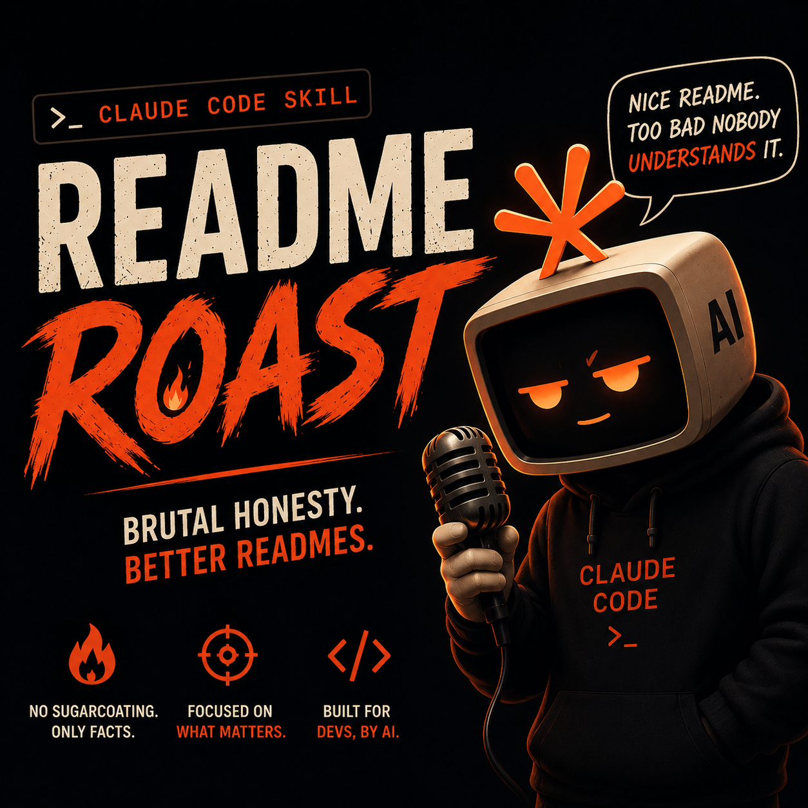

# 🔥 README-ROAST

<p align="center">
  <em>Your README is lying to you. Time for an intervention.</em>
</p>

<p align="center">
  
  
  <a href="https://discord.gg/RSBHHjxnYt"></a>
</p>

---

**README-ROAST** is a [Claude Code](https://claude.ai/code) skill that roasts your README. 8 personas. Honesty Score. One-liner. Badge. Fits in one screenshot. Equal parts savage and useful.

<p align="center">
  
</p>

---

## Quick Start

```bash
# Install (Claude Code skill)
# Place in ~/.claude/skills/readme-roast/

# Then:
/readme-roast                              # Roast current directory (random persona)
/readme-roast github.com/vercel/next.js    # Roast a remote repo
/readme-roast --ramsay                     # Gordon Ramsay yells at your README
/readme-roast --self                       # The skill roasts itself. Flex.
```

---

## 8 Personas

You never know who's showing up.

| Persona | Vibe | Signature |
|---------|------|-----------|
| 🍳 **Gordon Ramsay** | Chef rage | "Your install section is RAW." |
| 🌿 **David Attenborough** | Nature doc | "Here we see the junior dev, puffing up its README..." |
| 🕵️ **The Detective** | Noir PI | "The benchmarks folder was empty. Someone cleaned up." |
| 🧊 **The Ex** | Toxic ex | "'Production-ready.' That's what you said about your last project." |
| 👶 **The Toddler** | Asks why endlessly | "You said it's lightweight. Why? 847 deps. Why?" |
| 🎤 **Stand-Up Comedian** | Netflix special | "'Synergistic.' [pause] In a TODO app." |
| 🗿 **The Brutalist** | 5 words max | "This paragraph serves no purpose." |
| 🔥 **The Hypebeast** | Gen Z slang | "Your install steps? Mid. Feature list? Goated. fr fr." |

---

## What You Get

Every roast produces:

| Output | Description |
|--------|-------------|
| **Honesty Score** (0–100) | How truthful your README actually is, with color-coded scale |
| **Alternate README** | A complete honest rewrite with 8 required sections |
| **Report Card** | Per-category grades: Buzzwords, Features, Installation, Badges, Bus Factor |
| **Most Egregious Lie** | The single biggest gap between claim and reality, named and shamed |
| **One-Liner** | Under 280 chars, optimized for Twitter screenshots |
| **Honesty Certified Badge** | Embeddable shields.io badge for your real README |
| **ASCII Honesty Card** | A beautiful, shareable card for terminal screenshots |
| **Quick Wins** | 1-3 specific, actionable fixes the author can do right now |

---

## Demo

<p align="center">
  <video src="assets/demo.mp4" controls width="800" poster="assets/demo-screenshot.png"></video>
</p>

---

## Example Output

> Full example at [`examples/EXAMPLE-ROAST.md`](examples/EXAMPLE-ROAST.md)

```
┌────────────────────────────────────────────────────┐
│              🕵️ NOIR DETECTIVE — CASE FILE         │
│              Subject: some-project/README.md        │
└────────────────────────────────────────────────────┘

HONESTY SCORE: 51/100 🟡

"The README said 'no configuration required.' I've been doing this job
long enough to know that's never true."

REPORT CARD:
  Buzzword Restraint .... D+  (14 buzzwords in 200 words)
  Feature Honesty ....... C-  (claims 8 features, 5 exist)
  Installation Accuracy . F   (npm install does not work without Docker)
  Badge Discipline ...... B+  (3 badges, all links work)
  Bus Factor ............ D   (one maintainer, bus waiting outside)

GPA: 1.4 — Needs Intervention

🎯 "No configuration required" — said the tool that requires you to learn
   Webpack anyway, just six months later and under significantly more pressure.

🛡️ []()

Quick Wins:
  → Add "requires Docker" to install section (30 seconds)
  → Remove "blazing fast" until benchmarks exist
  → Pick a license. Any license. Literally any license at all.
```

---

## What It Actually Audits

The roast is funny but the audit is real. Here's what it checks:

| Check | What It Finds |
|-------|--------------|
| **Buzzword Density** | Exact counts of "modern," "blazing fast," "scalable," etc. |
| **Feature Inflation** | Claims vs. actual implemented features |
| **Installation Honesty** | Does your install section actually work? |
| **Badge Bloat** | Badges ÷ lines of documentation = bloat ratio |
| **The "Simple" Lie** | Claims "minimal" but has 847 dependencies |
| **Missing Crucial Info** | No license. No "what this doesn't do." No alternatives. |
| **Bus Factor** | How many people need to get hit by a bus before this dies |
| **Demo Rot** | Screenshots from v0.1. UI changed 4 times since. |
| **Contributing Theater** | CONTRIBUTING.md exists. Zero merged PRs from outsiders. |
| **The Empty Promise** | "Production-ready." Used by: the author and one friend. |

---

## Flags

```
/readme-roast --ramsay          # Gordon Ramsay
/readme-roast --attenborough    # David Attenborough
/readme-roast --detective       # Noir Detective
/readme-roast --ex              # The Ex (toxic, petty)
/readme-roast --toddler         # The Toddler (why? why?)
/readme-roast --comedian        # Stand-Up Comedian
/readme-roast --brutalist       # The Brutalist (5 words)
/readme-roast --hypebeast       # The Hypebeast (Gen Z)
/readme-roast --self            # Roast this skill itself
/readme-roast --full            # Full honest README rewrite
/readme-roast --badge-only      # Badge markdown only (CI)
/readme-roast --json            # JSON output (CI/CD)
/readme-roast --help            # All flags
```

---

## Installation

### Prerequisites
- **[Claude Code](https://claude.ai/code)** — the CLI or IDE extension. This is a Claude Code skill. It requires Claude Code. That's the one dependency.
- That's it. No npm. No Docker. No 14 undocumented steps.

### Setup
```bash
# Clone into your Claude Code skills directory
git clone https://github.com/KorroAi/readme-roast.git ~/.claude/skills/readme-roast

# Or just copy the files
cp -r path/to/readme-roast ~/.claude/skills/readme-roast/
```

The skill auto-registers. You'll see `/readme-roast` available immediately.

---

## What This Doesn't Do

This skill is honest about its limitations:

- **It cannot execute your code.** It can point out that your benchmark file is empty. It cannot run the benchmark.
- **It cannot verify remote repos deeply.** When roasting a URL, it sees stars, issues, and README text — not the actual code. The truth on the ground might be worse.
- **It does not replace a human reviewer.** It counts buzzwords and checks if files exist. A human reviewer smells fear.
- **It is not a linter.** It audits READMEs, not code quality. Your 800-line function is safe. For now.

---

## Why This Works

README-ROAST isn't just a joke generator. It's genuinely useful.

- **It catches real issues** — missing licenses, broken installation instructions, outdated demos
- **It forces honesty** — the alternate README is often a better README than the original
- **It's self-deprecating** — the best humor in open source is the kind where we laugh at ourselves
- **The badge spreads organically** — every Honesty Certified badge is a referral
- **5 personas = infinite replay** — you'll come back just to see what Attenborough says about your dependencies
- **The self-roast proves it's not a hypocrite** — `/readme-roast --self` is the ultimate credibility move

---

## The Roastmaster's Oath

> I will be **specific**, not generic. I will be **accurate**, not lazy. I will be **fair**, not cruel. I will make the project **better**, not just funnier. I will never **punch down**. I will always end with **something the author can fix**. I will, when asked, **roast myself first**.

---

## Contributing

Roasts, persona ideas, and audit dimension suggestions are welcome. Open an issue or PR.

If you contribute, be prepared: your PR will be roasted. That's the rules.

---

## License

MIT © [KorroAi](https://github.com/KorroAi)

---

<p align="center">
  <a href="https://discord.gg/RSBHHjxnYt"><b>💬 Join KORROCORP on Discord</b></a> — 
  <a href="https://github.com/korrocorp">GitHub</a> · 
  <a href="https://x.com/korrocorp">X</a>
</p>
